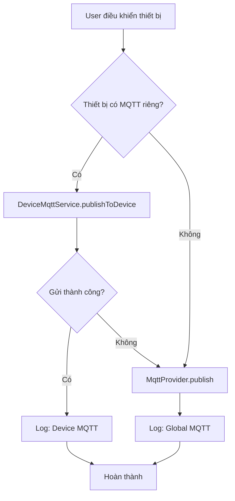
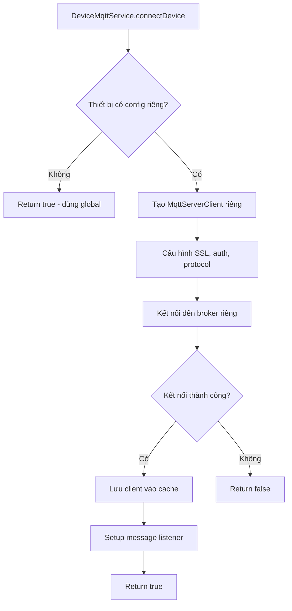

# 🚀 Tính năng MQTT riêng cho từng thiết bị

## 📋 Tổng quan

Tính năng này cho phép **mỗi thiết bị kết nối đến broker MQTT riêng biệt**, thay vì chỉ sử dụng một broker chung cho toàn bộ hệ thống.

### ✅ Lợi ích:

1. **Linh hoạt cao:** Mỗi thiết bị có thể kết nối đến broker khác nhau
2. **Bảo mật:** Thiết bị nhạy cảm có thể sử dụng broker riêng
3. **Phân tán:** Giảm tải cho một broker duy nhất
4. **Tương thích:** Hỗ trợ cả broker cũ và mới

## 🏗️ Kiến trúc

### 📁 Files đã tạo/cập nhật:

**Models:**
- ✅ `lib/models/device_mqtt_config.dart` - Model cấu hình MQTT cho thiết bị
- ✅ `lib/models/device_model.dart` - Cập nhật hỗ trợ mqttConfig

**Services:**
- ✅ `lib/services/device_mqtt_service.dart` - Service quản lý kết nối MQTT riêng
- ✅ `lib/providers/device_provider.dart` - Cập nhật để sử dụng broker riêng

**UI:**
- ✅ `lib/screens/devices/device_mqtt_config_screen.dart` - Giao diện cấu hình MQTT

## 🔧 Cách sử dụng

### 1. Cấu hình MQTT cho thiết bị:

```dart
// Tạo cấu hình MQTT riêng cho thiết bị
final mqttConfig = DeviceMqttConfig(
  deviceId: 'my_device',
  broker: 'mqtt.mybroker.com',
  port: 8883,
  username: 'device_user',
  password: 'device_password',
  useSsl: true,
  useCustomConfig: true,
  customTopic: 'my_custom/topic', // Tùy chọn
);

// Cập nhật thiết bị với cấu hình MQTT
final device = existingDevice.copyWith(mqttConfig: mqttConfig);
```

### 2. Điều khiển thiết bị:

```dart
// DeviceProvider sẽ tự động:
// 1. Kiểm tra thiết bị có cấu hình MQTT riêng không
// 2. Nếu có: gửi lệnh qua broker riêng
// 3. Nếu không: gửi qua broker global

deviceProvider.updateDeviceState('my_device', true);
```

### 3. Quản lý kết nối:

```dart
final deviceMqttService = DeviceMqttService();

// Kết nối thiết bị đến broker riêng
await deviceMqttService.connectDevice(device);

// Kiểm tra trạng thái kết nối
bool isConnected = deviceMqttService.isDeviceConnected('my_device');

// Ngắt kết nối
deviceMqttService.disconnectDevice('my_device');
```

## 📱 Giao diện người dùng

### Màn hình cấu hình MQTT:

1. **Thông tin thiết bị:** Hiển thị tên, loại, topic
2. **Toggle cấu hình riêng:** Bật/tắt sử dụng broker riêng
3. **Thông tin broker:** URL, port, SSL
4. **Xác thực:** Username, password (tùy chọn)
5. **Topic tùy chỉnh:** Override topic mặc định
6. **Kiểm tra kết nối:** Test trước khi lưu
7. **Lưu cấu hình:** Áp dụng thay đổi

### Cách truy cập:

```dart
Navigator.push(
  context,
  MaterialPageRoute(
    builder: (context) => DeviceMqttConfigScreen(device: device),
  ),
);
```

## 🔄 Luồng hoạt động

### Khi điều khiển thiết bị:



### Khi kết nối thiết bị:



## 🎯 Tính năng chính

### DeviceMqttConfig Model:

- ✅ **Broker riêng:** URL, port, SSL
- ✅ **Xác thực:** Username, password
- ✅ **Topic tùy chỉnh:** Override topic mặc định
- ✅ **Validation:** Kiểm tra cấu hình hợp lệ
- ✅ **JSON serialization:** Lưu/load từ storage

### DeviceMqttService:

- ✅ **Multi-broker support:** Quản lý nhiều kết nối
- ✅ **Connection management:** Auto-reconnect, cleanup
- ✅ **Message routing:** Gửi đến broker đúng
- ✅ **Status monitoring:** Theo dõi trạng thái kết nối
- ✅ **Callback system:** Event handling

### Device Model Extensions:

- ✅ **hasCustomMqttConfig:** Kiểm tra có cấu hình riêng
- ✅ **finalMqttTopic:** Lấy topic cuối cùng (custom hoặc default)
- ✅ **mqttBroker/Port/Username/Password:** Getter cho cấu hình
- ✅ **mqttClientId:** Tạo client ID unique

## 🔒 Bảo mật

- ✅ **SSL/TLS:** Hỗ trợ mã hóa kết nối
- ✅ **Authentication:** Username/password riêng cho từng thiết bị
- ✅ **Isolation:** Thiết bị riêng không ảnh hưởng lẫn nhau
- ✅ **Secure storage:** Lưu trữ an toàn thông tin xác thực

## 🚀 Kết quả

**Trước khi có tính năng:**
- Tất cả thiết bị dùng chung 1 broker MQTT
- Không linh hoạt trong việc quản lý kết nối
- Khó mở rộng khi cần nhiều broker

**Sau khi có tính năng:**
- ✅ Mỗi thiết bị có thể dùng broker riêng
- ✅ Giao diện thân thiện để cấu hình
- ✅ Tự động fallback về broker global
- ✅ Quản lý kết nối thông minh
- ✅ Hỗ trợ cả broker cũ và mới

---

**🎉 Tính năng đã sẵn sàng sử dụng!** Người dùng có thể cấu hình MQTT riêng cho từng thiết bị thông qua giao diện trực quan và điều khiển thiết bị sẽ tự động gửi lệnh đến broker tương ứng.

